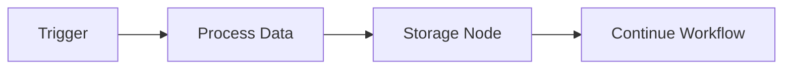
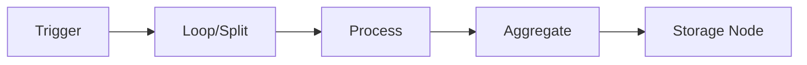
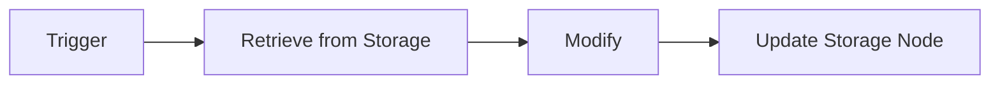
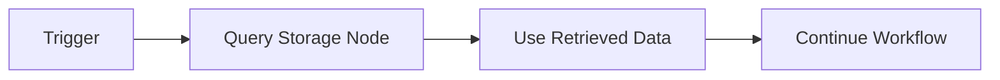

<!-- MCP snapshot taken 2026-09-11 — tool: mcp__claude_ai_n8n__get_workflow_best_practices (n8n MCP server). Verbatim tool output. technique="list" first, then the techniques mapped below from the coordinator's requested topics. -->

# n8n workflow best practices — MCP snapshot 2026-09-11

## Topic mapping (coordinator's requested topics → actual technique keys)

The tool's `technique` enum does not contain literal keys named "webhook api", "long running / async / polling", "error handling", "sub-workflows", "http api integration" or "database". `technique="list"` was called first (output below) to find the closest real match for each requested topic:

| Requested topic | Closest technique key | hasDocumentation | Called below? |
|---|---|---|---|
| webhook api | `web_app` (serving an app/API from a webhook) | true | yes |
| long running / async / polling | no exact match; closest are `scheduling` (true) and `monitoring` (**false**) | `scheduling`: true / `monitoring`: false | `scheduling` only |
| error handling | **no matching technique in the list at all** | — | **gap — not called, see below** |
| sub-workflows | **no matching technique in the list at all** | — | **gap — not called, see below** |
| http api integration | `scraping_and_research` (HTTP/API data collection) | true | yes |
| database | `data_persistence` (storing/updating/retrieving records) | true | yes |

**Gaps to report to the coordinator:** the best-practices tool currently has no dedicated technique for "error handling" or "sub-workflows" as such. Sub-workflow patterns (`n8n-nodes-base.executeWorkflow` / `executeWorkflowTrigger`) and error-handling nodes (`n8n-nodes-base.errorTrigger`, `.onError()`, `continueErrorOutput`/`continueRegularOutput`) exist and were captured in `node-types.md` and `sdk-reference.md` respectively, but no `get_workflow_best_practices` narrative document exists for either technique per this snapshot. Do not treat their absence here as "no guidance exists" — it means the guidance lives only in the SDK reference / node type definitions already captured, not in a dedicated best-practices technique.

---

## Call: `get_workflow_best_practices(technique: "list")`

```json
{
  "technique": "list",
  "message": "Found 17 workflow techniques. 12 have detailed best-practices documentation. Call this tool again with a specific technique key to fetch its guidance.",
  "availableTechniques": [
    {"technique": "scheduling", "description": "Running an action at a specific time or interval", "hasDocumentation": true},
    {"technique": "chatbot", "description": "Receiving chat messages and replying (built-in chat, Telegram, Slack, MS Teams, etc.)", "hasDocumentation": true},
    {"technique": "form_input", "description": "Gathering data from users via forms", "hasDocumentation": true},
    {"technique": "scraping_and_research", "description": "Methodically collecting information from websites or APIs to compile structured data", "hasDocumentation": true},
    {"technique": "monitoring", "description": "Repeatedly checking service/website status and taking action when conditions are met", "hasDocumentation": false},
    {"technique": "enrichment", "description": "Adding extra details to existing data by merging information from other sources", "hasDocumentation": false},
    {"technique": "triage", "description": "Classifying data for routing or prioritization", "hasDocumentation": true},
    {"technique": "content_generation", "description": "Creating text, images, audio, video, etc.", "hasDocumentation": true},
    {"technique": "document_processing", "description": "Taking action on content within files (PDFs, Word docs, images)", "hasDocumentation": true},
    {"technique": "data_extraction", "description": "Pulling specific information from structured or unstructured inputs", "hasDocumentation": true},
    {"technique": "data_analysis", "description": "Examining data to find patterns, trends, anomalies, or insights", "hasDocumentation": false},
    {"technique": "data_transformation", "description": "Cleaning, formatting, or restructuring data (including summarization)", "hasDocumentation": true},
    {"technique": "data_persistence", "description": "Storing, updating, or retrieving records from persistent storage (Google Sheets, Airtable, built-in Data Tables)", "hasDocumentation": true},
    {"technique": "notification", "description": "Sending alerts or updates via email, chat, SMS when events occur", "hasDocumentation": true},
    {"technique": "knowledge_base", "description": "Building or using a centralized information collection (usually vector database for LLM use)", "hasDocumentation": false},
    {"technique": "human_in_the_loop", "description": "Pausing for human decision/input before resuming", "hasDocumentation": false},
    {"technique": "web_app", "description": "Serving a single-page application (HTML + JS) from a webhook — dashboards, admin UIs, forms that need custom rendering", "hasDocumentation": true}
  ]
}
```

---

## Call: `get_workflow_best_practices(technique: "scheduling")` — proxy for "long running / async / polling"

# Best Practices: Scheduling Workflows

## Workflow Design

Structure scheduled workflows to perform focused, well-defined tasks.

For recurring tasks, use Schedule Trigger node with clear naming (e.g., "Daily 08:00 Trigger", "Every 6h Cron").

Prevent overlapping executions by ensuring worst-case execution time < schedule interval. For frequent schedules, implement mutex/lock mechanisms using external systems if needed.

## Scheduling Patterns

### Recurring Schedules

Use Schedule Trigger in two modes:
- **Interval Mode**: User-friendly dropdowns for common schedules (every X minutes, daily at 09:00, weekly on Mondays)
- **Cron Expression Mode**: Complex patterns using 5-field syntax (m h dom mon dow) with optional seconds field. Example: `0 9 * * 1` triggers every Monday at 09:00

Multiple schedules can be combined in single Schedule Trigger node using multiple Trigger Rules. Useful when same logic applies to different timings.

### One-Time Events

For event-relative scheduling, use Wait node to pause workflow until specified time/date.

Note: Cron expressions with specific dates (e.g., `0 12 22 10 *` for Oct 22 at 12:00) will repeat annually on that date.

### Conditional Scheduling

PREFER conditional logic over complex cron expressions. Use IF/Switch nodes after Schedule Trigger for runtime conditions:
- Check if today is last day of month before running monthly reports
- Skip execution on holidays by checking against a holiday list in a data table
- Route to "weekday" vs "weekend" processing based on current day

This approach is more readable and maintainable than complex cron patterns.

## Time Zone Handling

When building scheduled workflows:
- If user specifies a timezone, set it in the Schedule Trigger node's timezone parameter
- If user mentions times without timezone, use the schedule as specified (instance default will apply)
- For Wait nodes, be aware they use server system time, not workflow timezone

## Recommended Nodes

### Schedule Trigger (n8n-nodes-base.scheduleTrigger)

Primary node for running workflows on schedule. Supports interval mode for simple schedules and cron mode for complex patterns.

### Wait (n8n-nodes-base.wait)

Pause workflow execution until specified time or duration.

Use Cases:
- Delay actions relative to events
- One-off timers per data item
- Follow-up actions after specific duration

Best Practices:
- Use n8n Data Tables for waits longer than 24 hours (store scheduled time, check periodically)
- Avoid wait times longer than 7 days - use a polling pattern instead

### IF (n8n-nodes-base.if)

Add conditional logic to scheduled workflows.

Use Cases:
- Check date conditions (last day of month using expression: `{{ $now.day === $now.endOf('month').day }}`)
- Skip execution based on external data (e.g., holiday check)
- Route to different actions conditionally

Best Practices:
- Enable "Convert types where required" for comparisons
- Prefer IF nodes over complex cron expressions for readability

### Switch (n8n-nodes-base.switch)

Multiple conditional branches for complex routing.

Use Cases:
- Different actions based on day of week (e.g., `{{ $now.weekday }}` returns 1-7)
- Time-based routing (morning vs afternoon processing)
- Multi-path conditional execution

### n8n Data Tables (n8n-nodes-base.n8nTables)

Purpose: Store scheduling state and pending tasks

Use Cases:
- Track last execution time for catch-up logic
- Store list of pending one-time tasks with scheduled times
- Implement custom scheduling queue with polling

Best Practices:
- Query efficiently with proper filters
- Clean up completed tasks periodically

## Common Pitfalls to Avoid

### Missed Schedules During Downtime

**Problem**: Scheduled runs missed when n8n instance is down. No automatic catch-up for missed triggers.

**Solution**: Design idempotent workflows with catch-up logic:
- Store last successful run timestamp in n8n Data Tables
- On each run, check if enough time has passed since last run
- Example: For a task that should run once per 24 hours, schedule it every 4 hours but only execute if last run was >20 hours ago

### Overlapping Executions

**Problem**: Next scheduled run starts before previous completes, causing race conditions or resource conflicts.

**Solution**:
- Increase interval to exceed worst-case execution time
- Implement mutex/lock using n8n Data Tables (check/set "running" flag at start, clear at end)
- Add execution check at workflow start

### Wait Node Timezone Confusion

**Problem**: Wait node uses server system time, ignoring workflow timezone setting. Wait until "10:00" may not match expected timezone.

**Solution**:
- Account for server timezone when setting Wait times
- Use relative durations (e.g., "wait 2 hours") instead of absolute times when possible
- Prefer Schedule Trigger for timezone-aware scheduling

### First Execution Timing

**Problem**: First execution after activation doesn't match expected schedule. Activation time affects next run calculation.

**Solution**:
- Use manual execution for immediate first run if needed
- Understand that schedule recalculates from activation moment

### Cron Syntax

n8n supports both 5-field and 6-field (with seconds) cron syntax. Use 6 fields if you want to specify seconds (e.g., prefix with 0 for seconds: `0 0 9 * * *` for 9 AM daily).

For simple schedules, prefer Interval mode over cron for better readability.

---

## Call: `get_workflow_best_practices(technique: "scraping_and_research")` — proxy for "http api integration"

# Best Practices: Scraping & Research Workflows

## Performance & Resource Management

Batch requests and introduce delays to avoid hitting API rate limits or overloading target servers. Use Wait nodes and
batching options in HTTP Request nodes. When 429 rate limiting errors occur due to receiving too many requests,
implement batching to reduce request frequency or use the "Retry on Fail" feature to automatically handle throttled
responses.

Workflows processing large datasets can crash due to memory constraints. Use the Split In Batches node to process 200
rows at a time to reduce memory usage, leverage built-in nodes instead of custom code, and increase execution timeouts
via environment variables for better resource management.

## Looping & Pagination

Implement robust looping for paginated data. Use Set, IF, and Code nodes to manage page numbers and loop conditions,
ensuring you don't miss data or create infinite loops. Leverage n8n's built-in mechanisms rather than manual approaches:
use the $runIndex variable to track iterations without additional code nodes, and employ workflow static data or node
run indexes to maintain state across loop cycles.

## Recommended Nodes

### HTTP Request (n8n-nodes-base.httpRequest)

Purpose: Fetches web pages or API data for scraping and research workflows

Pitfalls:

- Depending on the data which the user wishes to scrape/research, it maybe against the terms of service to attempt to
fetch it from the site directly. Using scraping nodes is the best way to get around this
- Double-check URL formatting, query parameters, and ensure all required fields are present to avoid bad request errors
- Be aware of 429 rate limiting errors when the service receives too many requests - implement batching or use "Retry on
Fail" feature
- Refresh expired tokens, verify API keys, and ensure correct permissions to avoid authentication failures

### SerpAPI (@n8n/n8n-nodes-langchain.toolSerpApi)

Purpose: Give an agent the ability to search for research materials and fact-checking results that have been retrieved
from other sources.

### Perplexity (n8n-nodes-base.perplexityTool)

Purpose: Give an agent the ability to search utilising Perplexity, a powerful tool for finding sources/material for
generating reports and information.

### HTML Extract (n8n-nodes-base.htmlExtract)

Purpose: Parses HTML and extracts data using CSS selectors for web scraping

Pitfalls:

- Some sites use JavaScript to render content, which may not be accessible via simple HTTP requests. Consider using
browser automation tools or APIs if the HTML appears empty
- Validate that the CSS selectors match the actual page structure to avoid extraction failures

### Split Out (n8n-nodes-base.splitOut)

Purpose: Processes lists of items one by one for sequential operations

Pitfalls:
- Can cause performance issues with very large datasets - consider using Split In Batches instead

### Loop Over Items (Split in Batches) (n8n-nodes-base.splitInBatches)

Purpose: Processes lists of items in batches to manage memory and performance

Pitfalls:
- Ensure proper loop configuration to avoid infinite loops or skipped data. The index 0
(first connection) of the loop is treated as the done state, while the index 1 (second connection)
is the connection that loops.
- Use appropriate batch sizes (e.g., 200 rows) to balance memory usage and performance

### Edit Fields (Set) (n8n-nodes-base.set)

Purpose: Manipulates data, sets variables for loop control and state management

### Code (n8n-nodes-base.code)

Purpose: Implements custom logic for complex data transformations or pagination

Pitfalls:

- Prefer built-in nodes over custom code to reduce memory usage and improve maintainability
- Avoid processing very large datasets in a single code execution - use batching

### If (n8n-nodes-base.if)

Purpose: Adds conditional logic for error handling, loop control, or data filtering

Pitfalls:
- Validate expressions carefully to avoid unexpected branching behavior

### Wait (n8n-nodes-base.wait)

Purpose: Introduces delays to respect rate limits and avoid overloading servers

### Data Tables (n8n-nodes-base.dataTable)

Purpose: Stores scraped data in n8n's built-in persistent data storage

### Google Sheets (n8n-nodes-base.googleSheets)

Purpose: Stores scraped data in spreadsheets for easy access and sharing

### Microsoft Excel 365 (n8n-nodes-base.microsoftExcel)

Purpose: Stores scraped data in Excel files for offline analysis

### Airtable (n8n-nodes-base.airtable)

Purpose: Saves structured data to a database with rich data types and relationships

### AI Agent (@n8n/n8n-nodes-langchain.agent)

Purpose: For research, summarization, and advanced data extraction. AI agents can autonomously gather information
from websites, analyze content, and organize findings into structured formats, integrating tools for web scraping,
content analysis, and database storage

### Scraping Nodes

- Phantombuster (n8n-nodes-base.phantombuster)
- Apify (use HTTP Request or community node)
- BrightData (use HTTP Request or community node)

Purpose: If the user wishes to scrap data from sites like LinkedIn, Facebook, Instagram, Twitter/X, Indeed, Glassdoor
or any other service similar to these large providers it is better to use a node designed for this. The scraping
nodes provide access to these datasets while avoiding issues like rate limiting or breaking terms of service for
sites like these.

## Common Pitfalls to Avoid

Bad Request Errors: Double-check URL formatting, query parameters, and ensure all required fields are present to
avoid 400 errors when making HTTP requests.

Rate Limits: Use batching and Wait nodes to avoid 429 errors. When the service receives too many requests, implement
batching to reduce request frequency or use the "Retry on Fail" feature.

Memory Issues: Avoid processing very large datasets in a single run; use batching and increase server resources if
needed. Use Split In Batches node to process 200 rows at a time, leverage built-in nodes instead of custom code, and
increase execution timeouts via environment variables.

Empty or Unexpected Data: Some sites use JavaScript to render content, which may not be accessible via simple HTTP
requests. Standard HTTP and HTML parsing nodes fail because sites load data asynchronously via JavaScript, leaving the
initial HTML empty of actual content. Web scraping nodes can be used to avoid this.

---

## Call: `get_workflow_best_practices(technique: "data_persistence")` — proxy for "database"

# Best Practices: Data Persistence

## Overview

Data persistence involves storing, updating, or retrieving records from durable storage systems. This technique is essential when you need to maintain data beyond the lifetime of a single workflow execution, or when you need to access existing data that users have stored in their spreadsheets, tables, or databases as part of your workflow logic.

## When to Use Data Persistence

Use data persistence when you need to:
- Store workflow results for later retrieval or audit trails
- Maintain records that multiple workflows can access and update
- Create a centralized data repository for your automation
- Archive historical data for reporting or compliance
- Build data that persists across workflow executions
- Track changes or maintain state over time
- Store raw form inputs

## Choosing the Right Storage Node

### Data Table (n8n-nodes-base.dataTable) - PREFERRED

**Best for:** Quick setup, small to medium amounts of data

Advantages:
- No credentials or external configuration required
- Built directly into n8n
- Fast and reliable for small to medium datasets
- Ideal for prototyping and internal workflows
- No additional costs or external dependencies

When to use:
- Internal workflow data storage
- Temporary or staging data
- Admin/audit trails
- Simple record keeping
- Development and testing

### Google Sheets (n8n-nodes-base.googleSheets)

**Best for:** Collaboration, reporting, easy data sharing

Advantages:
- Familiar spreadsheet interface for non-technical users
- Easy to share and collaborate on data
- Built-in visualization and formula capabilities
- Good for reporting and dashboards
- Accessible from anywhere

When to use:
- Data needs to be viewed/edited by multiple people
- Non-technical users need access to data
- Integration with other Google Workspace tools
- Simple data structures without complex relationships
- Workflow needs access to existing spreadsheets in Google Sheets

Pitfalls:
- API rate limits can affect high-volume workflows
- Not suitable for frequently changing data
- Performance degrades with very large datasets (>10k rows)

### Airtable (n8n-nodes-base.airtable)

**Best for:** Structured data with relationships, rich field types

Advantages:
- Supports relationships between tables
- Rich field types (attachments, select, links, etc.)
- Better structure than spreadsheets

When to use:
- Data has relationships or references between records
- Need structured database-like features
- Managing projects, tasks, or inventory
- Workflow needs access to existing data in Airtable

Pitfalls:
- Requires Airtable account and API key
- Schema changes require careful planning

## Storage Patterns

### Immediate Storage Pattern

Store data immediately after collection or generation:



Best for: Raw data preservation, audit trails, form submissions

### Batch Storage Pattern

Collect multiple items and store them together:



Best for: Processing lists, batch operations, scheduled aggregations

### Update Pattern

Retrieve, modify, and update existing records:



Best for: Maintaining state, updating records, tracking changes

### Lookup Pattern

Query storage to retrieve specific records:



Best for: Enrichment, validation, conditional logic based on stored data

## Key Considerations

### Data Structure

- **Plan your schema ahead:** Define what fields you need before creating storage
- **Use consistent field names:** Match field names across your workflow for easy mapping
- **Consider data types:** Ensure your storage supports the data types you need
- **Think about relationships:** If data is related, consider Airtable or use multiple tables

### Performance

- **Batch operations when possible:** Multiple small writes are slower than batch operations
- **Use appropriate operations:** Use "append" for new records, "update" for modifications
- **Consider API limits:** Google Sheets has rate limits; plan accordingly for high-volume workflows

### Data Integrity

- **Store raw data first:** Keep unmodified input before transformations
- **Handle errors gracefully:** Use error handling to prevent data loss on failures
- **Validate before storing:** Ensure data quality before persistence
- **Avoid duplicates:** Use unique identifiers or upsert operations when appropriate

## Referencing Documents, Sheets, or Tables

When configuring storage nodes, use ResourceLocator mode "list". This will allow users to select from existing documents, sheets, or tables rather than passing IDs dynamically.
Use modes "id", "url" or "name" only when user specifically mentions it in their prompt.

## Important Distinctions

### Storage vs. Transformation

- **Set/Merge nodes are NOT storage:** They transform data in memory only
- **Storage happens explicitly:** Data won't persist unless you explicitly write it to storage

### Temporary vs. Persistent Storage

- **NOT covered by this technique:** Redis, caching, session storage, in-memory operations
- **This technique covers:** Durable storage that persists beyond workflow execution
- **Focus on permanence:** Use these nodes when you need data to survive restarts and be queryable later

## Common Pitfalls to Avoid

### Not Handling Duplicates

Without proper unique identifiers or upsert logic, you may create duplicate records. Use unique IDs or check for existing records before inserting.

### Ignoring Storage Limits

Each storage system has limits (row counts, API rates, file sizes). Design your workflow to work within these constraints or implement pagination/batching.

---

## Call: `get_workflow_best_practices(technique: "web_app")` — proxy for "webhook api"

# Best Practices: Web App Workflows (SPA served from a webhook)

## Architecture

Webhook (responseNode) → Code node (build HTML) → respondToWebhook (Content-Type: text/html).

Serve a single-page application from an n8n webhook. The workflow fetches data, then renders a full HTML page with a client-side framework (Alpine.js + Tailwind via CDN is the default stack — no build step needed).

## File-based HTML (REQUIRED for pages > ~50 lines)

Write the HTML to a separate file (e.g., `chunks/dashboard.html`), then in the SDK TypeScript code use `readFileSync` + `JSON.stringify` to safely embed it in a Code node. This eliminates ALL escaping problems:

1. Write your full HTML (with CSS, JS, Alpine.js/Tailwind) to `chunks/page.html`.
2. In `src/workflow.ts`: `const htmlTemplate = readFileSync(join(__dirname, '../chunks/page.html'), 'utf8');`
3. Use `JSON.stringify(htmlTemplate)` to create a safe JS string literal for the Code node's `jsCode`.
4. For data injection, embed a `__DATA_PLACEHOLDER__` token in the HTML and replace it at runtime.

**Do not embed large HTML directly in `jsCode`** — neither as template literals nor as arrays of quoted lines. Both break for real-world pages (20KB+). Always use the file-based pattern.

For small static HTML (< 50 lines), you may inline as an array of quoted strings + `.join('\n')`, but the file-based approach is still preferred.

## Data injection patterns

- **Static page (no server data):** embed HTML directly, no placeholder needed.
- **Dynamic data:** put `<script id="__data" type="application/json">__DATA_PLACEHOLDER__</script>` in the HTML. At runtime the Code node replaces `__DATA_PLACEHOLDER__` with base64-encoded JSON. Client-side: `JSON.parse(atob(document.getElementById('__data').textContent))`.
- Do not place bare `{{ $json... }}` expressions inside an HTML string parameter — they won't be evaluated.

## Multi-route SPA (dashboard with API endpoints)

Use multiple webhooks in one workflow — one serves the HTML page, others serve JSON API endpoints. The HTML's JavaScript uses `fetch()` to call sibling webhook paths.

## Responding correctly

Use `respondToWebhook` with `respondWith: "text"`, put the HTML in `responseBody` via expression, and set the `Content-Type` header to `text/html; charset=utf-8`.

## Example: Multi-route dashboard with DataTable API

**chunks/dashboard.html** — the full HTML page (write this file first):

```html
<!DOCTYPE html>
<html lang="en">
<head>
  <meta charset="UTF-8">
  <meta name="viewport" content="width=device-width, initial-scale=1.0">
  <title>Dashboard</title>
  <script src="https://cdn.tailwindcss.com"></script>
  <script defer src="https://cdn.jsdelivr.net/npm/alpinejs@3/dist/cdn.min.js"></script>
</head>
<body class="bg-gray-50 min-h-screen p-8">
  <h1 class="text-2xl font-bold mb-6">Dashboard</h1>
  <div x-data="app()" x-init="loadItems()">
    <template x-for="item in items" :key="item.id">
      <div class="bg-white rounded-lg shadow p-4 mb-3 flex items-center gap-3">
        <input type="checkbox" :checked="item.completed" @change="toggle(item)">
        <span x-text="item.title" :class="item.completed && 'line-through text-gray-400'"></span>
      </div>
    </template>
    <form @submit.prevent="addItem()" class="mt-4 flex gap-2">
      <input x-model="newTitle" placeholder="New item..." class="border rounded px-3 py-2 flex-1">
      <button type="submit" class="bg-blue-600 text-white px-4 py-2 rounded">Add</button>
    </form>
  </div>
  <!-- Server data injected at runtime (base64-encoded JSON) -->
  <script id="__data" type="application/json">__DATA_PLACEHOLDER__</script>
  <script>
    function app() {
      return {
        items: JSON.parse(atob(document.getElementById('__data').textContent)),
        newTitle: '',
        async toggle(item) {
          await fetch('/webhook/app/items/toggle', {
            method: 'POST', headers: {'Content-Type': 'application/json'},
            body: JSON.stringify({ id: item.id, completed: !item.completed })
          });
          item.completed = !item.completed;
        },
        async addItem() {
          if (!this.newTitle.trim()) return;
          const res = await fetch('/webhook/app/items/add', {
            method: 'POST', headers: {'Content-Type': 'application/json'},
            body: JSON.stringify({ title: this.newTitle })
          });
          const created = await res.json();
          this.items.push(created);
          this.newTitle = '';
        },
        loadItems() { /* items already loaded from __data */ }
      };
    }
  </script>
</body>
</html>
```

**src/workflow.ts** — the workflow with 4 webhook routes:

```javascript
import { workflow, node, trigger, expr } from '@n8n/workflow-sdk';
import { readFileSync } from 'fs';
import { join } from 'path';

// Read the HTML template at build time — eliminates all escaping issues
const htmlTemplate = readFileSync(join(__dirname, '../chunks/dashboard.html'), 'utf8');

// ── Webhooks ──────────────────────────────────────────────
const pageWebhook = trigger({
  type: 'n8n-nodes-base.webhook', version: 2.1,
  config: { name: 'GET /app', parameters: { httpMethod: 'GET', path: 'app', responseMode: 'responseNode', options: {} } }
});
const getItemsWebhook = trigger({
  type: 'n8n-nodes-base.webhook', version: 2.1,
  config: { name: 'GET /app/items', parameters: { httpMethod: 'GET', path: 'app/items', responseMode: 'responseNode', options: {} } }
});
const toggleWebhook = trigger({
  type: 'n8n-nodes-base.webhook', version: 2.1,
  config: { name: 'POST /app/items/toggle', parameters: { httpMethod: 'POST', path: 'app/items/toggle', responseMode: 'responseNode', options: {} } }
});
const addWebhook = trigger({
  type: 'n8n-nodes-base.webhook', version: 2.1,
  config: { name: 'POST /app/items/add', parameters: { httpMethod: 'POST', path: 'app/items/add', responseMode: 'responseNode', options: {} } }
});

// ── Route 1: Serve HTML page with pre-loaded data ─────────
const fetchAllItems = node({
  type: 'n8n-nodes-base.dataTable', version: 1.1,
  config: { name: 'Fetch Items', parameters: { resource: 'row', operation: 'get', dataTableId: { __rl: true, mode: 'name', value: 'items' }, returnAll: true, options: {} } }
});
const aggregateItems = node({
  type: 'n8n-nodes-base.aggregate', version: 1,
  config: { name: 'Aggregate', parameters: { aggregate: 'aggregateAllItemData', destinationFieldName: 'data', options: {} } }
});
// JSON.stringify in the SDK code creates a safe JS string literal — no escaping issues
const buildPage = node({
  type: 'n8n-nodes-base.code', version: 2,
  config: {
    name: 'Build Page',
    parameters: {
      mode: 'runOnceForAllItems',
      jsCode: 'var data = $input.all()[0].json.data || [];\n'
        + 'var encoded = Buffer.from(JSON.stringify(data)).toString("base64");\n'
        + 'var html = ' + JSON.stringify(htmlTemplate) + '.replace("__DATA_PLACEHOLDER__", encoded);\n'
        + 'return [{ json: { html: html } }];'
    }
  }
});
const respondHtml = node({
  type: 'n8n-nodes-base.respondToWebhook', version: 1.1,
  config: { name: 'Respond HTML', parameters: { respondWith: 'text', responseBody: expr('{{ $json.html }}'), options: { responseHeaders: { entries: [{ name: 'Content-Type', value: 'text/html; charset=utf-8' }] } } } }
});

// ── Route 2: GET items as JSON ────────────────────────────
const fetchItemsJson = node({
  type: 'n8n-nodes-base.dataTable', version: 1.1,
  config: { name: 'Get Items JSON', parameters: { resource: 'row', operation: 'get', dataTableId: { __rl: true, mode: 'name', value: 'items' }, returnAll: true, options: {} } }
});
const respondItems = node({
  type: 'n8n-nodes-base.respondToWebhook', version: 1.1,
  config: { name: 'Respond Items', parameters: { respondWith: 'allEntries', options: {} } }
});

// ── Route 3: Toggle item completion ───────────────────────
const updateItem = node({
  type: 'n8n-nodes-base.dataTable', version: 1.1,
  config: { name: 'Update Item', parameters: { resource: 'row', operation: 'update', dataTableId: { __rl: true, mode: 'name', value: 'items' }, matchingColumns: ['id'], columns: { mappingMode: 'defineBelow', value: { id: expr('{{ $json.body.id }}'), completed: expr('{{ $json.body.completed }}') }, schema: [{ id: 'id', displayName: 'id', required: false, defaultMatch: true, display: true, type: 'string', canBeUsedToMatch: true }, { id: 'completed', displayName: 'completed', required: false, defaultMatch: false, display: true, type: 'boolean', canBeUsedToMatch: false }] }, options: {} } }
});
const respondToggle = node({
  type: 'n8n-nodes-base.respondToWebhook', version: 1.1,
  config: { name: 'Respond Toggle', parameters: { respondWith: 'allEntries', options: {} } }
});

// ── Route 4: Add new item ─────────────────────────────────
const insertItem = node({
  type: 'n8n-nodes-base.dataTable', version: 1.1,
  config: { name: 'Insert Item', parameters: { resource: 'row', operation: 'insert', dataTableId: { __rl: true, mode: 'name', value: 'items' }, columns: { mappingMode: 'defineBelow', value: { title: expr('{{ $json.body.title }}'), completed: false }, schema: [{ id: 'title', displayName: 'title', required: false, defaultMatch: false, display: true, type: 'string', canBeUsedToMatch: true }, { id: 'completed', displayName: 'completed', required: false, defaultMatch: false, display: true, type: 'boolean', canBeUsedToMatch: false }] }, options: {} } }
});
const respondAdd = node({
  type: 'n8n-nodes-base.respondToWebhook', version: 1.1,
  config: { name: 'Respond Add', parameters: { respondWith: 'allEntries', options: {} } }
});

// ── Wire it all together ──────────────────────────────────
export default workflow('id', 'Item Dashboard')
  .add(pageWebhook).to(fetchAllItems).to(aggregateItems).to(buildPage).to(respondHtml)
  .add(getItemsWebhook).to(fetchItemsJson).to(respondItems)
  .add(toggleWebhook).to(updateItem).to(respondToggle)
  .add(addWebhook).to(insertItem).to(respondAdd);
```

**Key takeaway:** `JSON.stringify(htmlTemplate)` at build time produces a perfectly escaped JS string. The Code node's `jsCode` is just four lines. No escaping problems, no matter how large the HTML.
